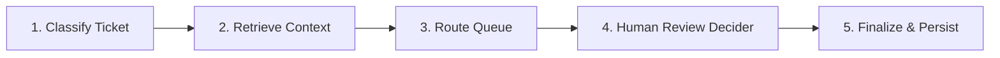

<p align="center">
  
</p>

# Triageo

Triageo is a production-style support ticket triage application built to learn and demonstrate LangGraph in a realistic engineering context. It classifies incoming support tickets, enriches them with retrieved local knowledge base context, assigns confidence scores, suggests routing targets, and determines whether human escalation is required.

The project is designed for a personal home-server environment and follows an architecture that mirrors real GenAI backend systems: FastAPI for HTTP endpoints, LangGraph for workflow orchestration, Docker for containerization, and a modern Tailwind-based dashboard for live demos.

---

## ⚡ The LangGraph Workflow

The core triage decisions are orchestrated as a deterministic linear state graph (`StateGraph`), preserving state visibility at each step:



1.  **`classify_ticket`**: Calls Gemini/OpenAI with a structured Pydantic schema to extract the category, priority level, model confidence score, and reasoning.
2.  **`retrieve_context`**: Conducts a fast keyword overlap search over 20+ local markdown policy files inside `./data/knowledge_base/` and matches relevant guides.
3.  **`route_ticket`**: A deterministic routing lookup routing tickets to queues based on category (e.g., `privacy_request` → `privacy-ops`).
4.  **`decide_human_review`**: Evaluates business logic rules (e.g., low confidence, critical priority, privacy tasks) to flag the ticket for human escalation.
5.  **`finalize_output`**: Captures the final graph state and commits it to a local SQLite database for historical lookup.

---

## 🛠️ Technology Stack

*   **Backend**: Python, FastAPI, LangGraph, Pydantic, SQLite3
*   **LLM Access**: LangChain integration (`langchain-google-genai` / Gemini 2.5 Flash Lite)
*   **Frontend**: Tailwind CSS CDN, Google Material Symbols, Vanilla JavaScript
*   **Deployment**: Docker Compose, Nginx Alpine, isolated Docker Network
*   **CI/CD**: GitHub Actions

---

## 📁 Repository Layout

```text
triageo/
├── .github/workflows/
│   └── ci.yml             # GitHub Actions CI syntax pipeline
├── apps/
│   ├── api/               # FastAPI application
│   │   ├── app/
│   │   │   ├── api/       # Router endpoints
│   │   │   ├── core/      # Config and LLM drivers
│   │   │   ├── graph/     # LangGraph nodes and compilation
│   │   │   ├── models/    # Pydantic schema types
│   │   │   └── services/  # Knowledge Base and SQLite DB layers
│   │   ├── Dockerfile
│   │   └── requirements.txt
│   └── web/               # Frontend dashboard static assets
│       ├── index.html
│       ├── style.css
│       ├── app.js
│       └── Dockerfile     # Nginx server
├── data/
│   └── knowledge_base/    # Local policy markdown docs
├── .env.example
├── docker-compose.yml     # Local/dev docker stack
├── docker-compose.prod.yml# Production stack with log caps
└── README.md
```

---

## 🚀 Running the Project

### Environment Setup
1. Copy the example environment file:
   ```bash
   cp .env.example .env
   ```
2. Fill in your target configurations, ports, and your `GEMINI_API_KEY`.

### 1. Running in Development Mode
Build and run the local development services:
```bash
docker compose up -d --build
```
*   **API Service**: `http://<host-ip>:8004` (Swagger docs available at `/docs`)
*   **Web Dashboard**: `http://<host-ip>:3004`

### 2. Running in Production Mode
Launches the stack with automated **log rotation limits** configured (caps logs at `10m` size with a limit of 3 files to save space on home servers):
```bash
docker compose -f docker-compose.prod.yml up -d --build
```

### 3. CI/CD Verification
Your commits pushed to `main` will automatically build the images and run Python compile checks using GitHub Actions.
